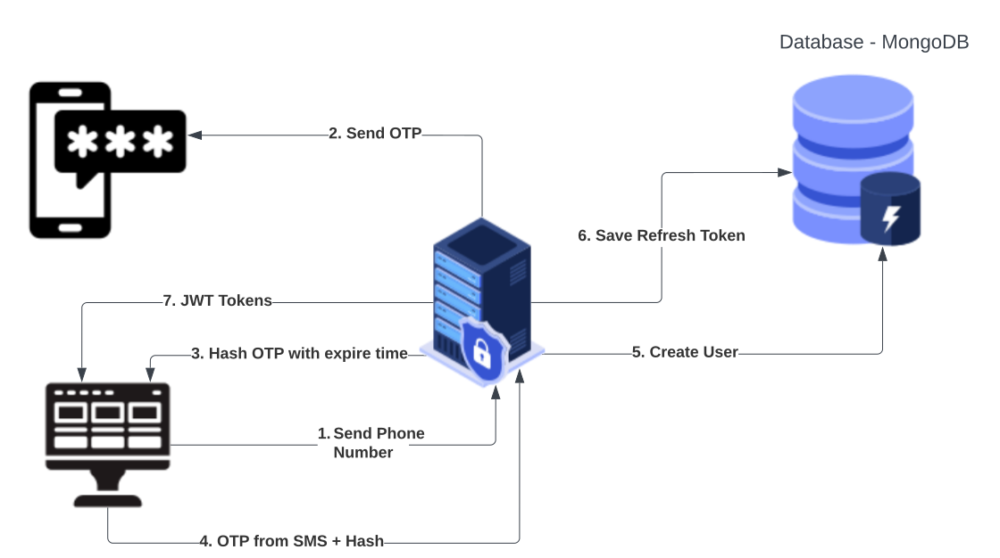

# 👨‍💻 DevCondo Project Requirements

### 🔥 Features

* Registration
  * Registration is done using the OTP system. The authentication can be validated through the phone number or email address.
  * The following information will be collected:
    1. Full Name
    2. Profile Picture
    3. Username
    
* Rooms
  * Authenticated user will be able to see a list of all available public rooms.
  * User can filter the rooms using the search box.
  * User can join existing rooms, or create a new room.
  * Creator of the room cann add other users as speakers.
  * Room can be of the following types:
    1. Public Room: Any authenticated user can see and join this room.
    2. Closed Room: Only can be joined through a special link.
    
* Room
  * Room can have 2 types of users:
    1. Speakers: People who can speak (Can mute/unmute themselves).
    2. Listeners: People who can only listen (Muted mic by default).
  * Any user can choose their Mic from available devices.
  * Only Creator of the room can delete the room.
  
* Profile
  * Users will have a user profile page.
  * Any authenticated user can visit this page and follow the user.
  * User should have followers and following count on the profile page.

* Login
  * User can login using OTP.
  * OTP will be sent on Phone number or Email address.
  
* Logout
  * User can logout using logout button.

### 🧷 Diagrams

